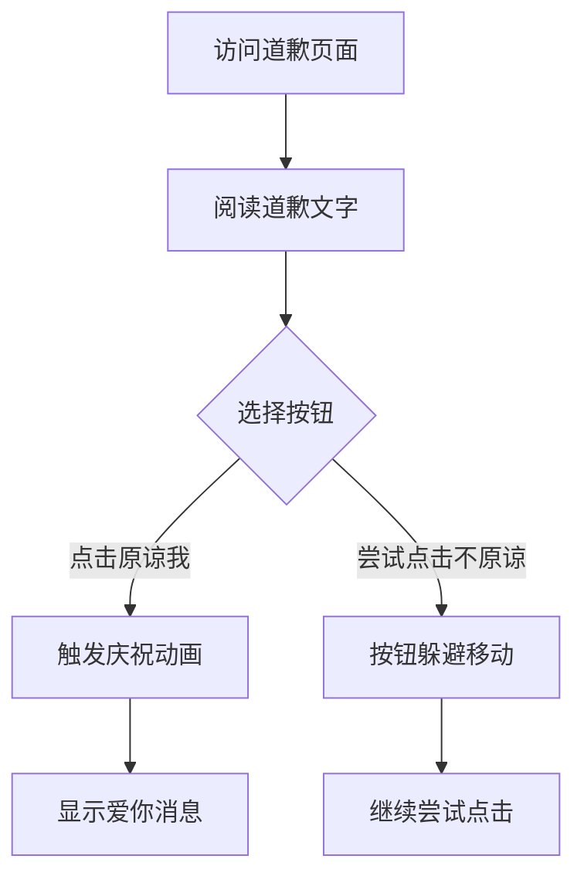

## 1. Product Overview
一个温馨浪漫的道歉页面，帮助用户以可爱有趣的方式向老婆表达歉意。通过精美的视觉效果和互动体验，传达真挚的道歉情感。

## 2. Core Features

### 2.1 User Roles
无需用户角色区分，这是一个单用户交互页面。

### 2.2 Feature Module
我们的浪漫道歉页面包含以下核心功能：
1. **道歉主页面**：浪漫视觉主题、道歉文字内容、互动按钮区域。

### 2.3 Page Details
| Page Name | Module Name | Feature description |
|-----------|-------------|---------------------|
| 道歉主页面 | 视觉主题区域 | 展示温馨浪漫的背景，使用柔和的粉色和白色主题色彩，包含可爱的占位图片或GIF动画 |
| 道歉主页面 | 文字内容区域 | 显示真挚的道歉文字，表达歉意和爱意，文字内容可自定义编辑 |
| 道歉主页面 | 互动按钮区域 | 包含两个核心按钮：原谅我按钮（触发庆祝动画）和不原谅按钮（躲避点击交互） |
| 道歉主页面 | 动画效果模块 | 原谅我按钮触发彩纸、烟花或爱心动画，显示"爱你"成功消息；不原谅按钮具有鼠标跟随躲避效果 |

## 3. Core Process
用户访问页面后，首先看到温馨的道歉界面。用户阅读道歉文字后，可以选择点击"原谅我"按钮或尝试点击"不原谅"按钮。点击原谅按钮会触发庆祝动画并显示爱意消息；尝试点击不原谅按钮时，按钮会智能躲避鼠标，增加趣味性。整个流程设计为轻松愉快的互动体验。

## 4. User Interface Design

### 4.1 Design Style
- **主色调**：柔和粉色 (#FFB6C1) 和纯白色 (#FFFFFF)
- **按钮样式**：圆角设计，带有悬停效果和阴影
- **字体**：优雅的手写风格字体，主要文字使用18-24px，标题使用32-36px
- **布局风格**：居中对称布局，卡片式设计，大量留白营造温馨感
- **图标风格**：可爱的心形、花朵、星星等emoji元素

### 4.2 Page Design Overview
| Page Name | Module Name | UI Elements |
|-----------|-------------|-------------|
| 道歉主页面 | 视觉主题区域 | 渐变粉色背景，中央白色半透明卡片，顶部装饰可爱GIF或静态图片，整体圆角设计 |
| 道歉主页面 | 文字内容区域 | 优雅的道歉文案，居中对齐，行间距1.5倍，使用深灰色文字增强可读性 |
| 道歉主页面 | 互动按钮区域 | 两个并排按钮：粉色"原谅我"按钮和浅灰色"不原谅"按钮，按钮大小适中，有明显的悬停状态变化 |
| 道歉主页面 | 动画效果模块 | 彩纸飘落动画使用多彩小纸片，烟花效果使用渐变圆形扩散，爱心动画采用浮动上升效果 |

### 4.3 Responsiveness
采用桌面优先设计，完全响应式布局。在移动设备上，按钮会垂直排列，文字大小适当调整，确保在小屏幕上仍有良好的用户体验。触摸交互优化，按钮点击区域足够大，动画效果流畅。

### 4.4 Animation Guidance
- **原谅动画**：使用Framer Motion实现平滑过渡，彩纸效果采用随机位置和旋转，持续2-3秒
- **按钮躲避**：基于鼠标位置计算按钮移动路径，使用弹簧动画效果，移动范围限制在可视区域内
- **成功消息**：淡入淡出效果，配合缩放动画，显示时间3秒后自动消失